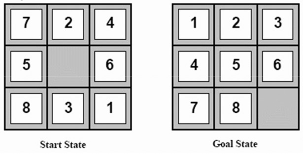
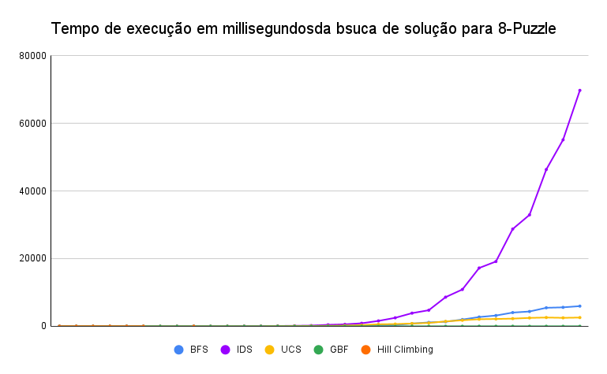
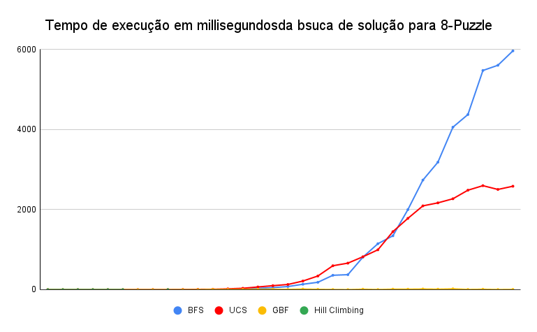

# Introdução

A proposta do trabalho desenvolvido é implementar a solução do jogo _8-Puzzle_ por meio de diversos algoritmos de busca diferentes. Ao fim, deseja-se comparar esses algoritmos em termos de tempo de execução e consumo de memória. O quebra-cabeça das oito peças (_8-Puzzle_) é composto por uma moldura 3x3 contendo um conjunto de peças numeradas de 1 a 8 e um espaço vazio. O propósito do jogo resume-se a posicionar as peças em uma determinada ordem (Figura 1) apenas deslizando-as pela moldura.


Figura 1: Estado inicial e final para o _8-Puzzle_

# Índice

- [Introdução](#introdução)
- [Índice](#índice)
- [Implementção](#implementção)
  - [Breadth-First Search](#breadth-first-search)
  - [Iterative Deepening Search](#iterative-deepening-search)
  - [Uniform-Cost Search](#uniform-cost-search)
  - [A-estrela](#a-estrela)
  - [Greedy Best-First Search](#greedy-best-first-search)
  - [Hill Climbing](#hill-climbing)
- [Compilando e executando](#compilando-e-executando)
- [Resultados](#resultados)

# Implementção

O código foi escrito utilizando C++ 17.
    
A main do programa é responsável por ler os parâmetros de execução e iniciar o processo de busca. Os parâmetros são o algoritmo a ser usado, a configuração inicial do puzzle e a opção para exibir ou não o caminho da solução encontrado. O comando é da forma:

```shell
$ ./TP1 [ALGORITMO] [CONFIGURACAO INICIAL] [?PRINT]
```

A solução pode ser encontrada através de diferentes algoritmos que podem ser acionados selecionaods pelo parâmetro ALGORITMO. As opções disponíveis são:
    
* B: breadth-first search (BFS)
* I: iterative deepening search (IDS)
* U: uniform-cost search (UCS)
* A: A-estrela (A*)
* G: greedy best-first search
* H: hill climbing
* P: resolver manualmente o puzzle

A função solve de cada Solver encontra a solução e retorna um solution\_t que nada mais é que uma fila de inteiros que codificam os movimentos da solução. Todos os algoritmos utilizam uma estrutura comum de nós da árvore de soluções, essa estrutura contém o estado atual do puzzle, o último movimento realizado, a quantidade total de movimentos realizados para se alcançar esse estado e um ponteiro para o nó pai. Os demais detalhes da implementação de cada um deles são apresentados a seguir.

## Breadth-First Search

O algoritmo da BFS ou busca em largura é ótimo e completo, portanto, sempre retorna a solução ótima caso ela exista. A BFS monta uma árvore dos possíveis estados percorrendo-a em largura, para isso utiliza uma fila de nós a serem visitados. A implementação utilizada revisita estados já visitados mas não expande nós já expandidos.

## Iterative Deepening Search

A implementação da busca com aprofundamento iterativo, ou IDS é baseada na busca em profundidade da árvore de estados, portanto utiliza uma pilha para salver nós a serem visitados. É um algoritmo ótimo e completo, portanto sempre encontra solução ótima caso exista. O algoritmo é iterativo e a cada iteração ele repete a busca incrementado o número máximo de movimentos que podem ser feitos antes de reiniciar. Esse valor começa em 1 e é incrementado linearmente de 1 em 1 unidade. A implementação utilizada revisita estados já visitados mas não expande nós já expandidos em uma mesma iteração.

## Uniform-Cost Search

O algoritmo da busca de custo uniforme, ou UCS é semelhante ao BFS mas utiliza uma fila de prioridade. A prioridade é definida pela distância do nó ao estado inicial, quanto menor sua distância maior a prioridade. Outra diferença para o BFS é que aqui não revisitamos estados.
    
## A-estrela

    Não implementado
    
## Greedy Best-First Search

O Greedy Best-First é um algoritmo guloso semelhante ao UCS, mas para a priorização da fila utiliza uma heurística. A heurística empregada é a quantidade de peças fora do lugar, que é admissível pois toda peça fora do lugar deverá ser movida ao menos uma vez.  
    
## Hill Climbing

O hill climbing é um algoritmo de busca local que visa maximizar a função objetivo. A implementação realizada do algoritmo está sujeita ficar presa em mínimos locais, portanto pode nem sempre encontrar a solução para o puzzle. Começando do estado inicial, buscamos os nós vizinhos existentes e navegamos para aquele com a melhor heurística até encontrar um máximo da função. Para evitar ficar preso em plateaus, o algoritmo pode fazer movimentos laterais para vizinhos com o mesmo valor objetivo. Esses movimentos laterais podem ser executado um número constante de vezes configurado como 8 (número de espaços do tabuleiro em que uma peça pode visitar não considerando sua posição atual).

# Compilando e executando

O projeto contém um makefile responsável pela compilação e execução do código. Use `make` ou `make build` para gerar o executável `TP1`. Para limpar os arquivos gerados pela compilação, use `make clean`. Para executar o conjunto de testes use `make test` e para gerar um relatório de tempos de execução utilize `make time`.

# Resultados

Observando os tempos de execução em millisegundos para cada algoritmo sob um conjunto de 32 testes (Figura 2), podemos notar que o IDS apresenta a maior tendência de crescimento.


Figura 2: Tempo de execução (ms) para algoritmos de busca.

Isolando os demais algoritmos (Figura 3) podemos fazer duas principais observações:

Nota-se que o BFS e o UCS apresentam tempos próximos inicialmente para as primeiras instâncias, conforme o tamanho do problema cresce, o UCS parece se aproximar de uma constante, enquanto o BFS continua a crescer.

Também é notável que os tempos do GBF e do Hill Climbing estão muito abaixo dos demais, contudo, é preciso lembrar que estes não são algoritmos ótimos e na maioria dos casos forneceram resultados incorretos, oGBF passou em 10 de 32  testes, enquanto o hill climbing passou em 7.


Figura 3: Comparação das tendências de crescimento do BFS, UCS, GBF e Hill Climbing.
